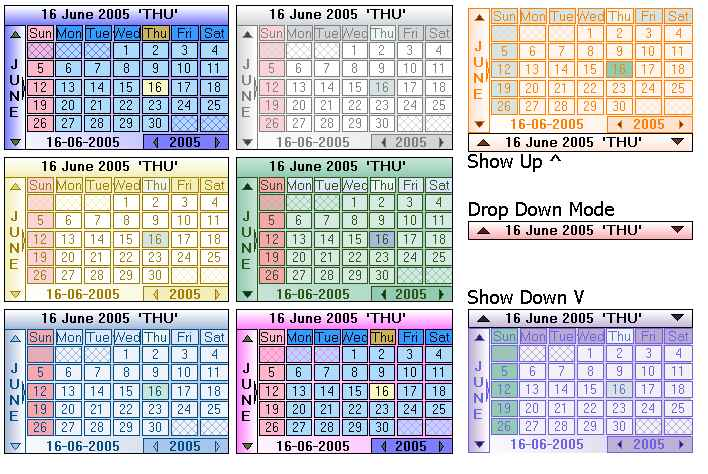



## McCalendar 1\.07 \- \[Advanced OwnerDrawn Dropdown Calendar\]

### Description

**Not an another big stack of controls**. This is an accurately build ownerdrawn, sizable, lightweight (not in code) calendar control with 'Dropdown' , 'List' mode and as beautiful as my girlfriend. The calendar is provided with unique form animation and eight different color-themes. The calendar if fully customisable with wide range of color options. A fresh technique is used to show the dropdown calendar. A help form is also included to understand the functionlity easly. Hope you all like it. Jim Jose ;-))
 
### More Info
 

             |
---                |---
**Submitted On**   |2005-06-19 11:19:00
**By**             |[JJJJJJJJ](https://github.com/Planet-Source-Code/PSCIndex/blob/master/ByAuthor/jjjjjjjj.md)
**Level**          |Intermediate
**User Rating**    |5.0 (80 globes from 16 users)
**Compatibility**  |VB 6\.0
**Category**       |[Custom Controls/ Forms/  Menus](https://github.com/Planet-Source-Code/PSCIndex/blob/master/ByCategory/custom-controls-forms-menus__1-4.md)
**World**          |[Visual Basic](https://github.com/Planet-Source-Code/PSCIndex/blob/master/ByWorld/visual-basic.md)
**Archive File**   |[McCalendar1904676232005\.zip](https://github.com/Planet-Source-Code/jjjjjjjj-mccalendar-1-07-advanced-ownerdrawn-dropdown-calendar__1-61220/archive/master.zip)

